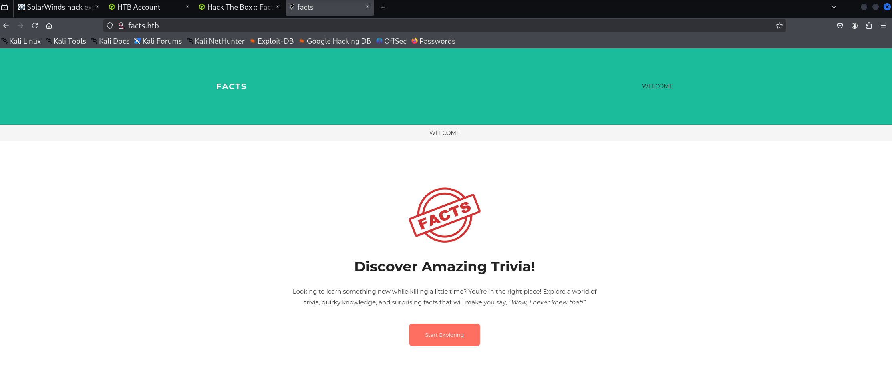
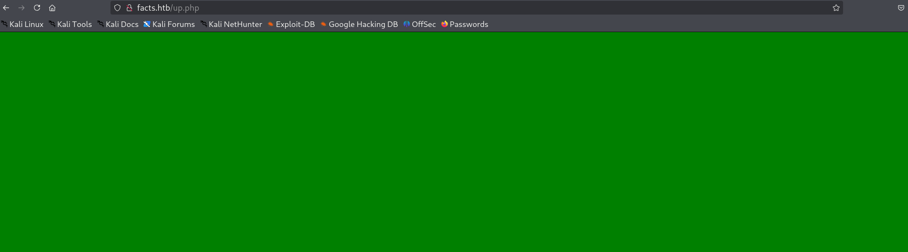
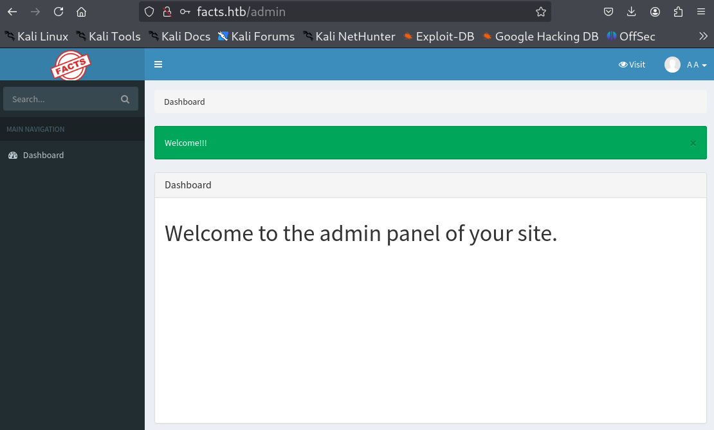

## nmap

PORT   STATE SERVICE VERSION
22/tcp open  ssh     OpenSSH 9.9p1 Ubuntu 3ubuntu3.2 (Ubuntu Linux; protocol 2.0)
| ssh-hostkey: 
|   256 4d:d7:b2:8c:d4:df:57:9c:a4:2f:df:c6:e3:01:29:89 (ECDSA)
|_  256 a3:ad:6b:2f:4a:bf:6f:48:ac:81:b9:45:3f:de:fb:87 (ED25519)
80/tcp open  http    nginx 1.26.3 (Ubuntu)
|_http-title: Did not follow redirect to http://facts.htb/
|_http-server-header: nginx/1.26.3 (Ubuntu)
Service Info: OS: Linux; CPE: cpe:/o:linux:linux_kernel

PORT      STATE SERVICE VERSION                                                                                                                                                                            
22/tcp    open  ssh     OpenSSH 9.9p1 Ubuntu 3ubuntu3.2 (Ubuntu Linux; protocol 2.0)                                                                                                                       
80/tcp    open  http?                                                                                                                                                                                      
54321/tcp open  unknown                                                                                                                                                                                    
Service Info: OS: Linux; CPE: cpe:/o:linux:linux_kernel     

sudo ./nmap_gemini.sh -H 10.129.244.96 -t All

1. Start with dirsearch

> dirsearch -u http://facts.htb -x 404

2. it has a search api


http://facts.htb/search?q=h




Target: http://facts.htb/

```
[20:25:01] Starting: 
[20:25:48] 200 -    7KB - /400                                              
[20:25:48] 200 -    5KB - /404                                              
[20:25:48] 200 -    5KB - /404.html                                         
[20:25:48] 200 -    8KB - /500                                              
[20:29:07] 200 -   99B  - /robots.txt                                       
[20:29:50] 200 -   73B  - /up.php                                           
```

> ffuf -u http://facts.htb/FUZZ -w /usr/share/wordlists/dirb/common.txt 

```

       v2.1.0-dev
________________________________________________

 :: Method           : GET
 :: URL              : http://facts.htb/FUZZ
 :: Wordlist         : FUZZ: /usr/share/wordlists/dirb/common.txt
 :: Follow redirects : false
 :: Calibration      : false
 :: Timeout          : 10
 :: Threads          : 40
 :: Matcher          : Response status: 200-299,301,302,307,401,403,405,500
________________________________________________

.passwd                 [Status: 200, Size: 11119, Words: 1328, Lines: 125, Duration: 435ms]
.forward                [Status: 200, Size: 11122, Words: 1328, Lines: 125, Duration: 831ms]
.bash_history           [Status: 200, Size: 11137, Words: 1328, Lines: 125, Duration: 831ms]
.history                [Status: 200, Size: 11122, Words: 1328, Lines: 125, Duration: 831ms]
.cvsignore              [Status: 200, Size: 11128, Words: 1328, Lines: 125, Duration: 1206ms]
.mysql_history          [Status: 200, Size: 11140, Words: 1328, Lines: 125, Duration: 831ms]
.svn                    [Status: 200, Size: 11110, Words: 1328, Lines: 125, Duration: 1207ms]
.ssh                    [Status: 200, Size: 11110, Words: 1328, Lines: 125, Duration: 1207ms]
.htpasswd               [Status: 200, Size: 11125, Words: 1328, Lines: 125, Duration: 1234ms]
.bashrc                 [Status: 200, Size: 11119, Words: 1328, Lines: 125, Duration: 1234ms]
.subversion             [Status: 200, Size: 11131, Words: 1328, Lines: 125, Duration: 1235ms]
.cache                  [Status: 200, Size: 11116, Words: 1328, Lines: 125, Duration: 1743ms]
.swf                    [Status: 200, Size: 11110, Words: 1328, Lines: 125, Duration: 1743ms]
.config                 [Status: 200, Size: 11119, Words: 1328, Lines: 125, Duration: 1744ms]
.htaccess               [Status: 200, Size: 11125, Words: 1328, Lines: 125, Duration: 1744ms]
.rhosts                 [Status: 200, Size: 11119, Words: 1328, Lines: 125, Duration: 1747ms]
.listing                [Status: 200, Size: 11122, Words: 1328, Lines: 125, Duration: 1744ms]
.web                    [Status: 200, Size: 11110, Words: 1328, Lines: 125, Duration: 1744ms]
.hta                    [Status: 200, Size: 11110, Words: 1328, Lines: 125, Duration: 1748ms]
.profile                [Status: 200, Size: 11122, Words: 1328, Lines: 125, Duration: 1745ms]
                        [Status: 200, Size: 11098, Words: 1328, Lines: 125, Duration: 1235ms]
.sh_history             [Status: 200, Size: 11131, Words: 1328, Lines: 125, Duration: 1748ms]
.perf                   [Status: 200, Size: 11113, Words: 1328, Lines: 125, Duration: 1748ms]
.listings               [Status: 200, Size: 11125, Words: 1328, Lines: 125, Duration: 1890ms]
.cvs                    [Status: 200, Size: 11110, Words: 1328, Lines: 125, Duration: 1891ms]
400                     [Status: 200, Size: 6685, Words: 993, Lines: 115, Duration: 1066ms]
404                     [Status: 200, Size: 4836, Words: 832, Lines: 115, Duration: 1036ms]
500                     [Status: 200, Size: 7918, Words: 1035, Lines: 115, Duration: 1058ms]
admin                   [Status: 302, Size: 0, Words: 1, Lines: 1, Duration: 1040ms]
admin.pl                [Status: 302, Size: 0, Words: 1, Lines: 1, Duration: 960ms]
admin.cgi               [Status: 302, Size: 0, Words: 1, Lines: 1, Duration: 1003ms]
admin.php               [Status: 302, Size: 0, Words: 1, Lines: 1, Duration: 1014ms]
ajax                    [Status: 200, Size: 0, Words: 1, Lines: 1, Duration: 1202ms]
cache                   [Status: 200, Size: 11116, Words: 1328, Lines: 125, Duration: 1889ms]
captcha                 [Status: 200, Size: 5180, Words: 18, Lines: 24, Duration: 2601ms]
config                  [Status: 200, Size: 11119, Words: 1328, Lines: 125, Duration: 1966ms]
cvs                     [Status: 200, Size: 11110, Words: 1328, Lines: 125, Duration: 1815ms]
CVS                     [Status: 200, Size: 11110, Words: 1328, Lines: 125, Duration: 1669ms]
en                      [Status: 200, Size: 11109, Words: 1328, Lines: 125, Duration: 1967ms]
error                   [Status: 500, Size: 7918, Words: 1035, Lines: 115, Duration: 1947ms]
forward                 [Status: 200, Size: 11122, Words: 1328, Lines: 125, Duration: 1666ms]
history                 [Status: 200, Size: 11122, Words: 1328, Lines: 125, Duration: 1669ms]
hta                     [Status: 200, Size: 11110, Words: 1328, Lines: 125, Duration: 1817ms]
htpasswd                [Status: 200, Size: 11125, Words: 1328, Lines: 125, Duration: 1788ms]
index                   [Status: 200, Size: 11113, Words: 1328, Lines: 125, Duration: 1893ms]
index.htm               [Status: 200, Size: 11125, Words: 1328, Lines: 125, Duration: 1766ms]
Index                   [Status: 200, Size: 11113, Words: 1328, Lines: 125, Duration: 1922ms]
index.html              [Status: 200, Size: 11128, Words: 1328, Lines: 125, Duration: 1799ms]
index.php               [Status: 200, Size: 11125, Words: 1328, Lines: 125, Duration: 1711ms]
listing                 [Status: 200, Size: 11122, Words: 1328, Lines: 125, Duration: 1967ms]
listings                [Status: 200, Size: 11125, Words: 1328, Lines: 125, Duration: 1930ms]
page                    [Status: 200, Size: 19593, Words: 3296, Lines: 282, Duration: 2413ms]
passwd                  [Status: 200, Size: 11119, Words: 1328, Lines: 125, Duration: 1934ms]
perf                    [Status: 200, Size: 11113, Words: 1328, Lines: 125, Duration: 1883ms]
post                    [Status: 200, Size: 11308, Words: 1414, Lines: 152, Duration: 2392ms
```

since error pages are identical

> ffuf -u http://facts.htb/FUZZ -w /usr/share/wordlists/dirb/common.txt -fr "Wow, I never knew that!”"

```

400                     [Status: 200, Size: 6685, Words: 993, Lines: 115, Duration: 945ms]
404                     [Status: 200, Size: 4836, Words: 832, Lines: 115, Duration: 887ms]
500                     [Status: 200, Size: 7918, Words: 1035, Lines: 115, Duration: 869ms]
admin                   [Status: 302, Size: 0, Words: 1, Lines: 1, Duration: 983ms]
admin.cgi               [Status: 302, Size: 0, Words: 1, Lines: 1, Duration: 946ms]
admin.php               [Status: 302, Size: 0, Words: 1, Lines: 1, Duration: 925ms]
admin.pl                [Status: 302, Size: 0, Words: 1, Lines: 1, Duration: 941ms]
ajax                    [Status: 200, Size: 0, Words: 1, Lines: 1, Duration: 999ms]
captcha                 [Status: 200, Size: 6498, Words: 21, Lines: 25, Duration: 2129ms]
error                   [Status: 500, Size: 7918, Words: 1035, Lines: 115, Duration: 2071ms]
page                    [Status: 200, Size: 19593, Words: 3296, Lines: 282, Duration: 1989ms]
post                    [Status: 200, Size: 11308, Words: 1414, Lines: 152, Duration: 2129ms]
robots.txt              [Status: 200, Size: 99, Words: 12, Lines: 2, Duration: 1886ms]
robots                  [Status: 200, Size: 33, Words: 2, Lines: 1, Duration: 1989ms]
rss                     [Status: 200, Size: 183, Words: 20, Lines: 9, Duration: 2003ms]
search                  [Status: 200, Size: 19187, Words: 3276, Lines: 272, Duration: 2250ms]
sitemap.gz              [Status: 500, Size: 7918, Words: 1035, Lines: 115, Duration: 1847ms]
sitemap.xml             [Status: 200, Size: 3508, Words: 424, Lines: 130, Duration: 1817ms]
sitemap                 [Status: 200, Size: 3508, Words: 424, Lines: 130, Duration: 2139ms]
up                      [Status: 200, Size: 73, Words: 4, Lines: 1, Duration: 1887ms]
:: Progress: [4614/4614] :: Job [1/1] :: 20 req/sec :: Duration: [0:03:37] :: Errors: 0 ::

```

found /admin page - wordpress


3. Wordpress. Things to try

find the username

User Enumeration

Before you can crack a password, you need a valid username. WordPress often leaks these.

    Author Archives: Try navigating to /?author=1, /?author=2, etc. Often, the URL will redirect to /author/username/.

    JSON API: Check /wp-json/wp/v2/users. This is a common data leak that provides a list of registered users.

    WPScan: Use the industry standard tool: wpscan --url http://facts.htb/ --enumerate u

2. Plugin and Theme Analysis

Most WordPress vulnerabilities aren't in the core code, but in outdated plugins or themes.

    Identify Plugins: Look at the page source for paths like /wp-content/plugins/.

    Vulnerability Scanning: Use WPScan to check for known CVEs: wpscan --url http://facts.htb/ --enumerate p --plugins-detection aggressive

    Manual Check: If you find a plugin name and version, search Exploit-DB or CVE Details for "Unauthenticated RCE" or "LFI."

3. Password Attacks

If you have a username (like admin) and no known software exploits, you move to brute forcing.

    WPScan Brute Force: wpscan --url http://facts.htb/ -U admin -P /usr/share/wordlists/rockyou.txt

    Note: In HTB, if a brute force takes more than a few minutes, there is likely a different intended path (like a configuration file leak elsewhere on the box).

4. Gaining Execution (Post-Login)

If you manage to log in as an Administrator, your goal is a Reverse Shell.

    Theme Editor: Go to Appearance > Theme Editor. Select a template (like 404.php) and replace its content with a PHP Reverse Shell.

    Malicious Plugin: Zip a PHP reverse shell into a folder, upload it as a "New Plugin," and activate it.

    Trigger: Navigate to the file location (usually /wp-content/themes/[theme-name]/404.php) to execute the shell.

Pro-Tips for HTB

    Check /etc/hosts: Ensure facts.htb is mapped to the machine's IP address, or some plugins might not load correctly.

    Look for Backups: Sometimes developers leave wp-config.php.bak or .zip files in the root directory which contain database credentials.

5. port 54321 is open.

> rustscan -a facts.htb --ulimit 5000 -r 1-65535 -- -A -sC -Pn

6. login on admin panel



7. follow https://thecybersecguru.com/ctf-walkthroughs/mastering-facts-beginners-guide-from-hackthebox/


